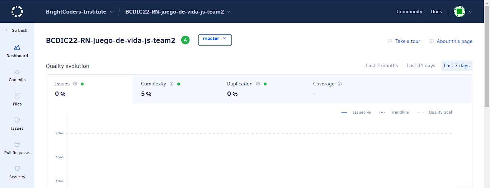

# El Juego de la vida
- [Ver instrucciones](./instructions.md)

- Juego de la vida - Equipo 2

- Table of contents
- - Celulas.js: Código refactorizado Orientado a Objetos. Genera la matriz de tamaño arbitrario y genera las células vivas y muertas en posiciones aleatorias.
- - JuegoDeLaVida.js: Mismo código que en Celulas.js pero sin POO.
- - Matriz.js: Archivo utilizado para intentar generar la matriz de las células y posteriormente incluirlo en Celulas.js.
- - Prueba.js: Archivo que intenta emular la distribución de las células a través de las generaciones.

- Description:
- - Este proyecto intenta ilustrar el Juego de la Vida de John Conway mediante el uso de arrays bidimensionales. Está desarrollado en javascript e implementamos el uso de ESLint para estadarizar el código. Hicimos pruebas unitarias con jest y refactorizamos. Además utilizamos Codacy, un analizador de código.

- How to Install and Run the Project.
- - Para poder utilizar el codigo lo que se debe de hacer es descargar el repositorio desde GitHub. Para poder correr el proyecto, se abre la terminal en el directorio del proyecto y se ejecuta esta linea de codigo: node Celulas.js o node Prueba.js

- How to Use the Project. 
- - Si se requiere probar los demás archivos, sólo se pone el nombre seguido de "node". Ejemplo, node Prueba.js. Ningún archivo requiere la introducción de argumentos.

-  Créditos
- - Baltazar Padilla Carlos Alejandro
- - China Santa Ana Arturo Alejandro
- - Garcia Gonzalez Gerardo Ismael
- - Manrique Zamora Adrián
- - Ochoa Flores Esmeralda Jomary

- Badges
- - Codacy: A
- - Linter: Correcto
- - Prueba con jest

